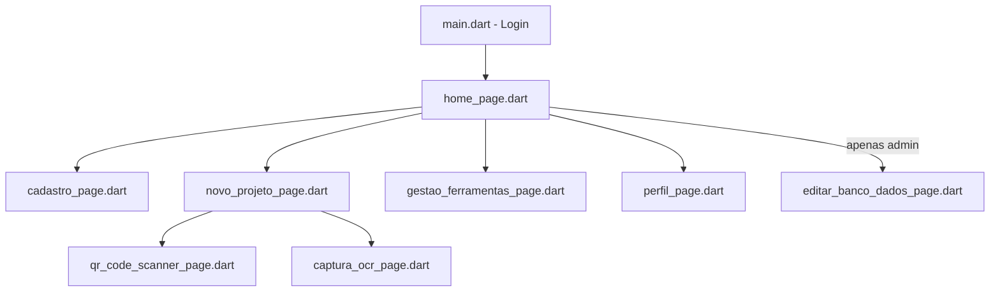

# Documentação Técnica — Celacantoapp

> Última atualização: 2026-08-14. Este documento descreve como o app funciona, como as partes se
> interligam e quais pontos merecem atenção. Mantenha-o atualizado conforme o código evoluir.

## 1. Visão geral

Aplicativo Flutter (Android/iOS/Windows/macOS) para gestão de calibração de instrumentos/ferramentas
e execução de projetos de medição em campo (ex: qualificação de fluxo laminar, ar comprimido, cabines
de exaustão, HVAC). Um operador escaneia/digita a TAG de cada instrumento exigido pelo escopo do
projeto, o app valida se a calibração está em dia, captura leituras de displays via OCR, e gera um
relatório Word (.docx) preenchido a partir de um template.

Funciona **offline-first**: todo dado é gravado localmente (SQLite) e sincronizado com o Firestore
quando há conexão.

- **Projeto Firebase**: `ocrion-eda2a` (Android, iOS, macOS, Windows — ver [firebase_options.dart](lib/firebase_options.dart)).
- **Dart SDK**: `^3.11.5`.

## 2. Camadas do código (`lib/`)

- **Páginas (UI)**: `main.dart` (login), `home_page.dart`, `cadastro_page.dart`, `novo_projeto_page.dart`,
  `gestao_ferramentas_page.dart`, `perfil_page.dart`, `editar_banco_dados_page.dart`,
  `qr_code_scanner_page.dart`, `captura_ocr_page.dart`.
- **Serviços**: `auth_service.dart` (login/cadastro/Firebase Auth), `instrumento_service.dart`
  (busca/sincronização híbrida de instrumentos, local + nuvem), `relatorio_service.dart` (geração do
  Word), `database_helper.dart` (SQLite local, singleton).
- **Modelos**: `usuario_model.dart`, `empresa_model.dart`, `instrumento_model.dart`, `projeto_model.dart`,
  `leitura_model.dart`.
- **Utilitários**: `validadores.dart` (CPF/CNPJ/e-mail), `firestore_colecoes.dart` (nomes de coleções
  centralizados).

## 3. Navegação

## 4. Fluxos principais

### 4.1 Login / Cadastro (`auth_service.dart`)
- Autenticação real via **Firebase Auth** (email/senha). O perfil (`operador`/`supervisor`/`admin`) e
  demais dados ficam no Firestore (`usuarios`) e em cache local (SQLite).
- `loginLocal` tenta login online primeiro; só recorre à sessão do Firebase Auth em cache
  (`_auth.currentUser`) quando o erro é especificamente de rede (`network-request-failed`/`timeout`) —
  uma rejeição real de credencial (senha errada, conta desabilitada) nunca usa esse fallback.
- O domínio da empresa (`dominioEmpresa`) é extraído do e-mail (parte após `@`) e é o campo usado para
  isolar dados por empresa/tenant em todas as coleções.

### 4.2 Gestão de Ferramentas (`gestao_ferramentas_page.dart` + `instrumento_service.dart`)
- CRUD de instrumentos na coleção `instrumentos` (doc ID = TAG em maiúsculas).
- `InstrumentoService.listarPorDominio` mostra o cache local imediatamente e depois atualiza com a
  nuvem (filtrando por `dominio_empresa`), persistindo de volta no SQLite.
- Botões de **Exportar/Importar Planilha** (xlsx/csv) permitem edição em massa: exporta os dados
  atuais, o usuário edita no Excel, reimporta e os campos não vazios sobrescrevem os existentes
  (campos vazios na planilha não apagam dados já cadastrados).
- Existe também um script standalone (`scripts/import_ferramentas/import.js`, Node + firebase-admin)
  usado uma única vez para importar a planilha `SIVS_PADROES_*.xlsx` — não faz parte do app em si.

### 4.3 Novo Projeto (`novo_projeto_page.dart`)
1. Escolhe/cadastra a empresa (`EmpresaModel`, coleção `empresas`, doc ID = domínio). Trocar a empresa
   ou o tipo de projeto no meio do fluxo limpa as ferramentas/leituras já validadas.
2. Escolhe o tipo de projeto (`_escoposETestes`), que determina a lista de ferramentas exigidas.
3. Para cada ferramenta exigida: escaneia QR ou digita a TAG (`_processarValidacaoFerramenta` →
   `InstrumentoService.buscarPorTag`). A TAG deve começar com o prefixo esperado (`_prefixosPorTipo`).
   - Se a calibração estiver **válida**: segue.
   - Se estiver **vencida**: abre diálogo de liberação por supervisor (`_solicitarLiberacaoSupervisor`)
     — **ver ponto de atenção 5.1 (a senha digitada ainda não é validada contra o Firebase Auth)**.
4. Opcionalmente captura leituras de displays via OCR (`captura_ocr_page.dart`, ML Kit).
5. `_criarProjetoFinal` (protegido contra duplo toque via `_salvandoProjeto`) grava o projeto em
   `projetos` (Firestore + SQLite), gera o relatório Word via `RelatorioService.gerarRelatorioProjeto`
   e avisa o usuário se o Word não pôde ser gerado ou se alguma leitura ficou de fora do template.
   Também dispara `sincronizarProjetosPendentes()` em segundo plano para reenviar projetos presos
   offline de sessões anteriores.

### 4.4 Geração de Relatório (`relatorio_service.dart`)
- Abre o `.docx` template (ZIP+XML) de `assets/templates/`, faz `String.replaceAll` de placeholders
  (`{PROJETO}`, `{EMPRESA}`, `{TAG_...}`, `{VALOR_N}`, etc.) diretamente no XML e regrava o ZIP.
  **Não usa a dependência `docx_template` do pubspec** — é feito manualmente.
  Todos os valores interpolados passam por `_escaparXml` (`&`/`<`/`>`/`"`/`'`) antes de entrar no XML,
  evitando `.docx` corrompido quando um nome/tag contém esses caracteres.
- Suporta até `RelatorioService.maxSlotsLeituraTemplate` (10) leituras OCR por relatório; o operador é
  avisado se o projeto tiver mais leituras do que isso.

### 4.5 Sincronização offline → nuvem
- `DatabaseHelper.sincronizarProjetosPendentes()` roda no `main()` (cold start) **e** é disparada
  novamente (fire-and-forget) ao final de cada `_criarProjetoFinal` bem-sucedido, para reenviar
  projetos que ficaram pendentes de sessões anteriores assim que há uma conexão ativa. Ainda não existe
  um listener de conectividade nem um botão manual de "sincronizar agora" — ver ponto de atenção 5.2.

## 5. Pontos de atenção

> Itens de estilo/lint (imports não usados, duplicação de lógica, `BuildContext` após `await`, senhas
> em texto puro, strings mágicas, etc.) já foram identificados e **corrigidos** em revisão anterior.
> Os itens abaixo são de uma revisão funcional mais profunda feita em 2026-08-14.

### Ainda em aberto
1. **Liberação de supervisor não verifica senha** ([novo_projeto_page.dart](lib/novo_projeto_page.dart)
   `_solicitarLiberacaoSupervisor`): o campo de senha é lido mas nunca validado contra o Firebase Auth —
   apenas o e-mail é checado (`perfil == supervisor|admin`). Qualquer pessoa que souber o e-mail de um
   supervisor pode liberar o uso de um instrumento vencido. Requer decisão de produto sobre como
   reautenticar um segundo usuário no mesmo dispositivo sem derrubar a sessão do operador logado (ex:
   uma instância secundária do Firebase App só para essa verificação).
2. **Sincronização ainda não tem listener de conectividade nem botão manual** — apenas roda no cold
   start e ao final de cada criação de projeto bem-sucedida (ver 4.5). Um projeto criado offline e sem
   nenhuma criação de projeto subsequente só sincroniza no próximo restart do app.
3. Importação de planilha (`gestao_ferramentas_page.dart`) sem limite de linhas/tamanho de arquivo e
   sem uso de `WriteBatch` (grava uma linha por vez).
4. `qr_code_scanner_page.dart`/`captura_ocr_page.dart` não tratam `didChangeAppLifecycleState` —
   risco de câmera travar ao voltar de segundo plano.
5. Falhas de migração do SQLite (`_onUpgrade`) são apenas logadas, nunca surfaced ao usuário.
6. `validadeEhValida` compara com `DateTime.now()` local do aparelho — se o fuso horário do celular do
   técnico estiver errado, a validade pode virar horas antes/depois do esperado no último dia do mês.

### Corrigidos em 2026-08-14
- Corrupção do Word por caracteres especiais não escapados no XML — corrigido com `_escaparXml`.
- Falha silenciosa na geração do Word reportada como sucesso — agora avisa o usuário quando
  `gerarRelatorioProjeto` retorna `null`.
- Duplo toque em "Finalizar Projeto" podia criar dois `projetos` — corrigido com guarda `_salvandoProjeto`.
- Fallback de login offline aceitava sessão em cache mesmo após rejeição real de credencial — agora só
  usa o cache para erros de rede (`network-request-failed`/`timeout`).
- Leituras OCR além do 10º slot eram descartadas sem aviso — agora há um snackbar informativo.
- Ferramentas/leituras validadas não eram limpas ao trocar de empresa no meio do fluxo — agora são.

## 6. Coleções do Firestore

| Coleção | Doc ID | Campos | Model |
|---|---|---|---|
| `usuarios` | `uid` do Firebase Auth | `nome`, `cpf`, `email`, `perfil`, `dominioEmpresa` | [usuario_model.dart](lib/usuario_model.dart) |
| `empresas` | `dominio` (parte do e-mail após `@`) | `cnpj`, `razao_social`, `nome_fantasia`, `dominio`, `projetosModelo`, `projetosFinais` | [empresa_model.dart](lib/empresa_model.dart) |
| `instrumentos` | `tag` (maiúscula) | `tipo`, `tag`, `numeroSerie`, `numeroCertificado`, `validade` (`"MM/AAAA"`), `estaValido` (0/1), `dominio_empresa` | [instrumento_model.dart](lib/instrumento_model.dart) |
| `projetos` | `PRJ-<timestamp ms>` | `id`, `cnpjEmpresa`, `tipoProjeto`, `ferramentasRequeridas`, `ferramentasEscaneadas`, `leiturasOcr`, `dataCriacao`, `operadorResponsavel` | [projeto_model.dart](lib/projeto_model.dart) |

Nomes de coleções centralizados em [firestore_colecoes.dart](lib/firestore_colecoes.dart) — sempre
usar essa classe em vez de strings soltas.

## 7. Banco local (SQLite, `celacanto_local_database.db`, versão 4)

- `usuarios(id PK, nome, cpf, email UNIQUE, senha [sempre NULL desde v4], perfil, dominio_empresa)`
- `empresas(cnpj PK, razaoSocial, nomeFantasia, dominio_empresa)`
- `instrumentos(id PK, tipo, tag UNIQUE, numeroSerie, numeroCertificado, validade, estaValido, dominio_empresa)`
- `projetos(id PK, cnpjEmpresa, tipoProjeto, ferramentasRequeridas[json], ferramentasEscaneadas[json], leiturasOcr[json], dataCriacao, operadorResponsavel, templateUtilizado, sincronizado)`

A senha nunca é mais persistida localmente — autenticação real é 100% Firebase Auth (ver seção 5,
item sobre o fallback offline).

## 8. Integrações externas

- **Firebase Auth** — login/cadastro por e-mail e senha.
- **Cloud Firestore** — fonte de verdade na nuvem, com persistência offline habilitada e cache
  ilimitado (`Settings(persistenceEnabled: true, cacheSizeBytes: -1)` em `main.dart`).
- **Google ML Kit Text Recognition** — OCR de displays de instrumentos (`captura_ocr_page.dart`).
- **camera** — captura de foto para OCR (usado inclusive no Windows).
- **mobile_scanner** — leitura de QR Code das TAGs (`qr_code_scanner_page.dart`).
- **archive + xml** (manual) — geração do relatório Word (ZIP+XML), *não* usa a dependência
  `docx_template` apesar de estar no `pubspec.yaml`.
- **sqflite / sqflite_common_ffi** — cache local (FFI usado em Windows/Linux/macOS).
- **excel / csv / file_picker / share_plus** — exportação/importação em massa de ferramentas.

## 9. Histórico de manutenção relevante

- 2026-08-14: revisão de 7 tópicos de estilo/lint (lógica duplicada, senhas em texto puro, código
  morto, tratamento de erro silencioso, `BuildContext` após `await`, strings mágicas, duplicação do
  `EmpresaModel`) — todos corrigidos, `flutter analyze` limpo.
- 2026-08-14: revisão funcional mais profunda e correção de 6 problemas reais (ver seção 5) — XML sem
  escaping no relatório Word, falha silenciosa na geração do Word, duplo envio de projeto, fallback de
  login offline incorreto, leituras OCR descartadas sem aviso, estado não limpo ao trocar de empresa.
  Item pendente: verificação real de senha na liberação por supervisor (requer decisão de produto).
- 2026-08-13/14: importação em massa de ~412 ferramentas do arquivo `SIVS_PADROES_*.xlsx` para a
  coleção `instrumentos` via `scripts/import_ferramentas/import.js`.
